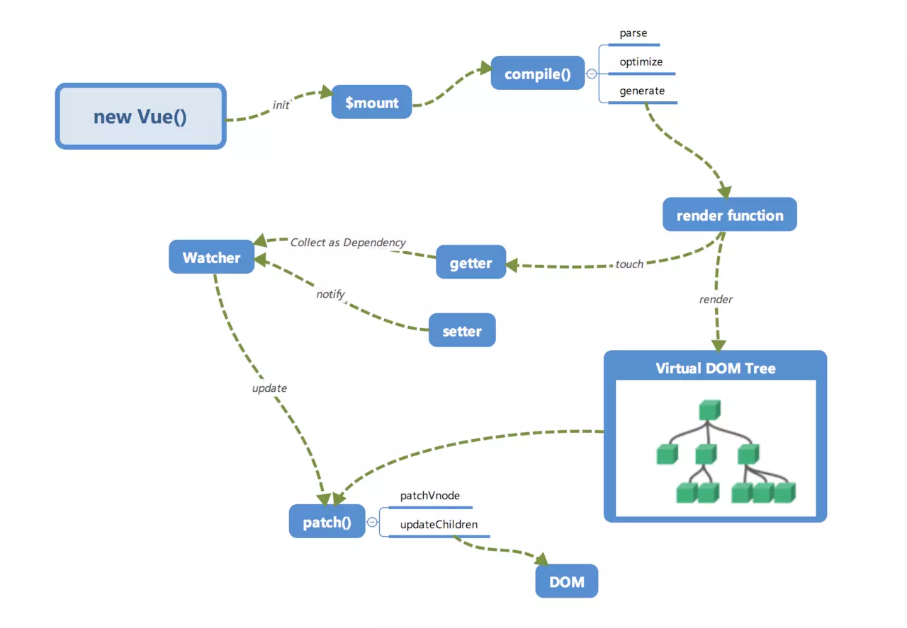

## Proxy

#### 为什么要取代 `Object.defineProperty`

既然要取代 `Object.defineProperty`, 那么它肯定是有一些明显的缺点, 总结起来大概是以下两点

> 1. 在 `Vue` 中, `Object.defineProperty` 在检测数组变化时, 考虑到性能问题, 只对下面7中做了响应式处理
```js
  push()
  pop()
  shift()
  unshift()
  splice()
  sort()
  reverse()
```
- 由于只针对以上八种方法进行了 `hack` 处理, 所以其他数组的属性也时检测不到的, 还是具有一定的局限性

> 2. `Object.defineProperty` 只节能劫持`对象的属性`, 因此我们需要对每个对象的每个属性进行遍历. `Vue`里, 是通过递归以及遍历 `data` 对象来实现对数据的监控的, 如果属性值也是对象那么需要深度遍历, 显然如果能劫持一个完整的对象, 不管是对操作性还是性能都会有一个很大的提升

## 使用`Proxy` 有下面两个优点

> 1. 可以劫持整个对象， 并返回一个新对象
> 2. 有13种劫持操作

`Proxy`是 `es6` 提供的新特性, 兼容性不好, 最主要是这个属性无法用 `polyfill` 来兼容

> <font size="2">`Proxy`是 `es6` 中新增的一个特性, 翻译过来的意思, 用在这里表示由它来 “代理” 某些操作</font>
 
> <font size="2">`Proxy` 让我们能够以简洁易懂的方式控制外部对象的访问. 某些功能非常类似设计模式中的代理模式</font>

> <font size="2">`Proxy` 可以理解成, 在目标对象之前架设一层 "拦截", 外界对该对象的访问, 都必须先通过这层拦截, 因此提供了一种机制, 可以对外界的访问进行过滤和改写</font>

> <font size="2">使用 `Proxy` 的核心优点是可以交由它来处理一些非核心逻辑（如：读取或设置对象的某些属性前记录日志; 设置对象的某些属性值前, 需要验证; 某些属性的访问控制等）. 从而可以让对象只需要关注于核心逻辑, 达到关注点分离, 降低对象复杂度等目的</font>

```js
let p = new Proxy(targe, handler)
```

`target` 是用 `Proxy` 包装的被代理对象(可以是任何类型的对象, 包括原生数组, 函数, 甚至另一个代理)

`handler` 是一个对象, 其声明了代理 `target` 的一些操作, 其属性是当执行一个操作时定义代理的行为的函数

`p` 是代理后的对象. 当外界每次对 `p` 进行操作时, 就会执行 `handler` 对象上的一些方法. `Proxy` 共有13种劫持操作, `handler` 代理的一些常用的方法有如下几个:

```js
	get: 读取
	set: 修改
	has: 判断对象
	construct: 构造函数
```

具体可以参考这里： [vue3.0 尝鲜 -- 摒弃 Object.defineProperty，基于 Proxy 的观察者机制探索](https://juejin.im/post/5bf3e632e51d452baa5f7375)

基于 `Proxy` 来实现 `vue` 的观察者模式

## 1. `Proxy` 实现 `observe`

```js
observe (data) {
	const that = this;
	let handler = {
		get (target, property) {
			return target[property];
		},
		set (target, key, value) {
			let res = Reflect.set(target, key, value);
			that subscribe[key].map(item => {
				item.update();
			})
			
			return res;
		}
	}
	
	this.$data = new Proxy(data, handler);
}
```

<font size="2">&nbsp;&nbsp; 这段代码里面代理器返回的对象代理到 `this.$data`, 即 `this.$data` 是代理后的对象, 外部每次对 `this.$data` 进行操作时, 实际上执行的是这段代理里面的 `handler` 对象上的方法</font>

## 2. `compile` 和 `watcher`

> vue2.x在 new Vue() 之后。 Vue 会调用 _init 函数进行初始化，它会初始化生命周期、事件、 props、 methods、 data、 computed 与 watch 等。其中最重要的是通过 Object.defineProperty 设置 setter 与 getter 函数，用来实现「响应式」以及「依赖收集」。类似于下面这个内部流程图：



[具体实现可以参考这个库](https://github.com/nightzing/vue3-Proxy/blob/master/proxyVue.html)